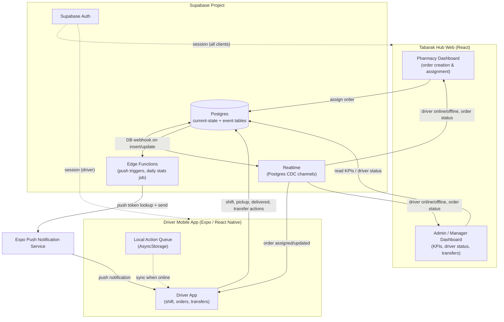
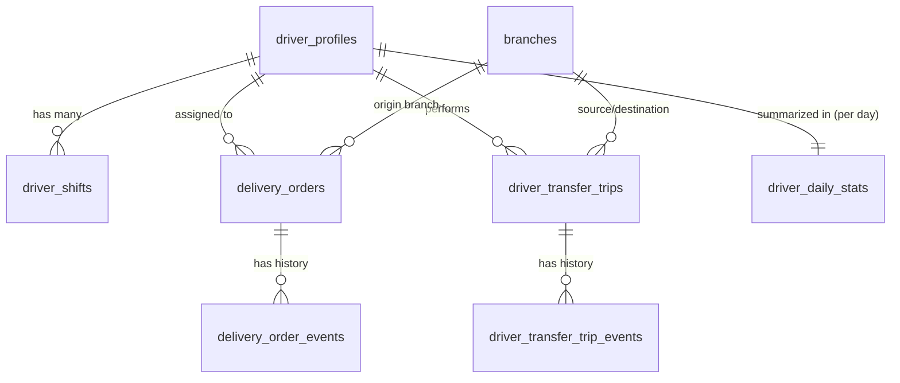
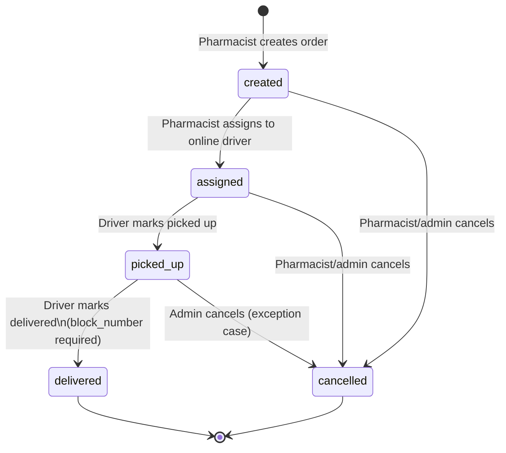
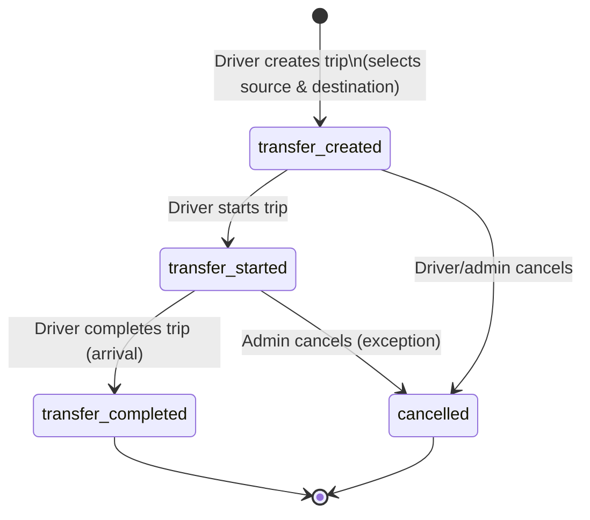
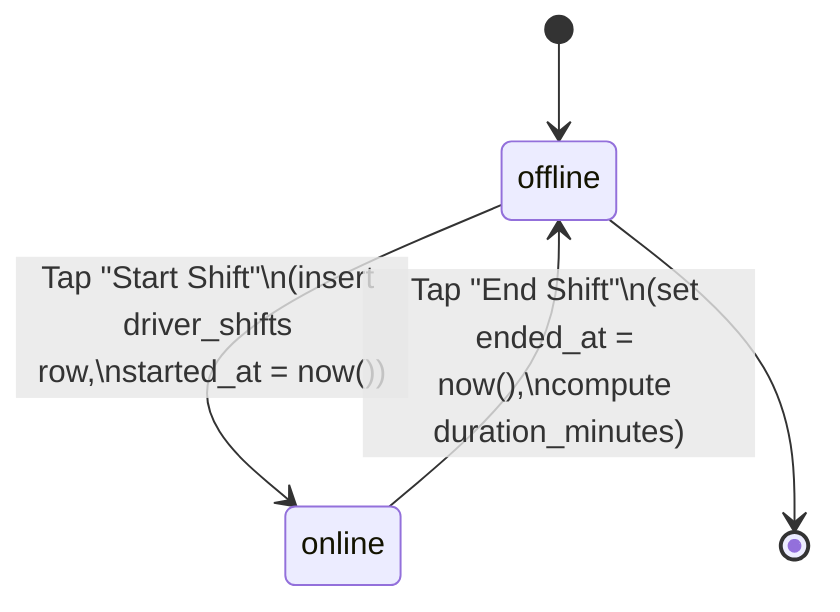

# Delivery Driver Mobile App — Implementation Plan
### Tabarak Hub — Driver Module Integration

> **Status:** Planning baseline plus implemented MVP notes. The original plan remains the source of truth for the full product scope; the repository now contains an initial driver mobile MVP foundation.
>
> **Implementation update (2026-06-16):** A web-integrated MVP foundation now exists in this repo. It reuses `delivery_drivers`, links drivers to Auth through `delivery_drivers.auth_user_id`, adds shift/stats/mobile RPCs, and adds an Expo app at `apps/driver-mobile`. See `docs/DELIVERY_DRIVER_MOBILE_MVP_RUNBOOK.md`.
>
> **QA update (2026-06-16):** Production route smoke passed for `/` and `/delivery`, production JS contains the driver UI/RPC integration, and the local Expo web app runs at `http://localhost:8091`. A controlled T001 QA order (`5066ffca`) was assigned to the linked driver and completed through the driver-scoped mobile RPC path from `assigned` to `picked_up` to `delivered`. Reset the test driver password as a precaution because the original temporary password briefly touched a tracked working-tree env example before cleanup. See `docs/DRIVER_APP_QA_RESULTS.md`.
>
> **Notifications update (2026-06-16):** The driver mobile app now includes a real Notifications screen for active/incoming route orders, bell navigation, top-header back navigation, safe-area-aware header/bottom nav handling, one-shot in-app alarm playback, and native notification sound registration for `apps/driver-mobile/src/assets/sounds/driver.mp3`. Custom push notification sounds still require native/dev-build validation because Expo Go may not fully honor custom notification sound assets.

> **Status-flow update (2026-06-16):** The implemented MVP flow is status-only for the driver app: a branch-recorded order with a selected driver becomes `assigned`, appears in driver Notifications with the pharmacy name, then the driver moves it `assigned -> picked_up -> delivered`. Driver-side block-number double-check/audit prompts are removed; pharmacy Dispatch remains the live status surface for every lifecycle transition.

> **Pickup-batch update (2026-06-16):** Local implementation now adds pickup batches/delivery runs. A driver can select multiple same-pharmacy assigned orders and start one pickup run, giving all selected orders the same pickup timestamp while each order still records its own delivery timestamp and stop sequence. Dispatch calculates pickup wait, driver delivery time, total fulfillment time, and pickup-run size.
>
> **History update (2026-06-16):** Driver History was refined so `Delivered` orders are placed into local closed-history state immediately after successful completion, merged with server history by stable order id, and displayed through Time-first filters (`All`, `Picked up`, `Delivered`, `Cancelled`, `Internal transfer`). Expo web shell and responsive viewport smoke passed; authenticated delivered-after-refresh QA remains pending until an approved driver session and clearly marked QA order are available.
>
> **Preview QA update (2026-06-16):** Preview `https://tabarakhub-8zesyh2lw-ames-projects-7ab0c189.vercel.app` for commit `152a429` returns the protected root React shell through `vercel curl`, but the Expo driver app route was not independently proven on that root preview. Use `cd apps/driver-mobile && npm run web` for local driver-web QA or provide a dedicated driver-app preview/session before production promotion.
>
> **Important caveat:** This plan was produced without direct access to the Tabarak Hub repository. Section 2 documents the assumptions made and provides a discovery checklist that **must be executed first** (Phase 0) so the implementation agent can reconcile this plan with the real codebase before writing any code.

---

## Table of Contents

1. [Executive Summary](#1-executive-summary)
2. [Current Project Discovery Summary](#2-current-project-discovery-summary)
3. [Recommended Architecture](#3-recommended-architecture)
4. [Mobile App Technology Recommendation](#4-mobile-app-technology-recommendation)
5. [User Roles and Permissions](#5-user-roles-and-permissions)
6. [Supabase Data Model Proposal](#6-supabase-data-model-proposal)
7. [API / Service Layer Plan](#7-api--service-layer-plan)
8. [Order Lifecycle](#8-order-lifecycle)
9. [Transfer Trip Lifecycle](#9-transfer-trip-lifecycle)
10. [Driver Shift Lifecycle](#10-driver-shift-lifecycle)
11. [Driver Mobile App Screens](#11-driver-mobile-app-screens)
12. [Pharmacy Dashboard Changes](#12-pharmacy-dashboard-changes)
13. [Admin / Manager Dashboard Changes](#13-admin--manager-dashboard-changes)
14. [Realtime Sync Plan](#14-realtime-sync-plan)
15. [Push Notification Plan](#15-push-notification-plan)
16. [KPI Definitions and Formulas](#16-kpi-definitions-and-formulas)
17. [Database Performance & Scalability Plan](#17-database-performance--scalability-plan)
18. [Security and RLS Plan](#18-security-and-rls-plan)
19. [Offline / Poor-Network Strategy](#19-offline--poor-network-strategy)
20. [Implementation Phases](#20-implementation-phases)
21. [Testing Checklist](#21-testing-checklist)
22. [Risks and Mitigations](#22-risks-and-mitigations)
23. [Open Questions for Product Owner](#23-open-questions-for-product-owner)

---

## 1. Executive Summary

Tabarak Hub is a pharmacy operations platform (React + Supabase) with pharmacist and admin/manager dashboards. This plan defines a **new native React (Expo) mobile app for delivery drivers**, plus the Supabase schema additions and dashboard changes needed to support it.

**Core principles guiding this plan:**

| Principle | Description |
|---|---|
| Single source of truth | Supabase (Postgres + Auth + Realtime) remains the backend for both the web dashboards and the driver app. No separate backend is introduced. |
| No location tracking | The system tracks **discrete events and timestamps only** (online/offline, picked up, delivered, transfer start/complete) — never continuous GPS. |
| Healthy event logging | ~9–10 event types, expected at **900–1,500 event rows/day** at 300 orders/day — well within Postgres's comfortable range with proper indexing. |
| Current-state + audit split | "Live" tables (`delivery_orders`, `driver_transfer_trips`, `driver_profiles`) hold current state for fast reads; `*_events` tables hold append-only history for audit/KPI recomputation. |
| Fast dashboards | A `driver_daily_stats` summary table is updated incrementally so admin KPI dashboards never recompute from raw events on every page load. |
| Realtime-first UX | Supabase Realtime (filtered by `driver_id` / `branch_id`) pushes assignment, status, and shift changes to the right screens within ~1–2 seconds. |
| Production-practical mobile stack | **Expo (managed workflow + EAS Build)** is recommended over bare React Native CLI for faster delivery, OTA updates, and built-in push notification support — appropriate for a small/medium operations app. |

**What this plan delivers:** a full schema proposal (7 tables + 1 supporting table), RLS policy outline, service/API function map, screen-by-screen mobile app spec, dashboard change list, realtime channel design, push notification plan, KPI formulas, performance plan, offline/sync strategy, phased implementation roadmap, and a testing checklist.

---

## 2. Current Project Discovery Summary

### 2.1 Why this section exists

The brief explicitly asks for the plan to "reference actual existing files/modules discovered in the project," but no repository access was provided. Rather than inventing fictitious file paths and presenting them as fact, this section:

1. States the **assumptions** this plan relies on (based on the stated tech stack: React + Supabase, pharmacy/admin dashboards already exist).
2. Provides a **Phase 0 discovery checklist** the implementation agent must run against the real Tabarak Hub repo before building anything in Phase 1.
3. Defines **fallback conventions** to use if the discovered codebase doesn't match the assumptions.

### 2.2 Assumptions used throughout this plan

| Area | Assumption | If wrong, fallback |
|---|---|---|
| Supabase client | A single shared client exists, e.g. `src/lib/supabase.ts` or `src/services/supabaseClient.ts`, exporting a configured `createClient()` instance. | Create one shared client in both web and mobile codebases following whatever pattern is found; do not instantiate multiple clients. |
| Service layer | Domain logic lives in `src/services/<domain>Service.ts` files exporting async functions that wrap Supabase queries (e.g. `orderService.ts`, `pharmacyService.ts`). | If services are colocated with components instead, follow that pattern but isolate driver-module logic into new dedicated files for testability. |
| Types | Shared TypeScript types live in `src/types/*.ts` and are imported by both services and components. | Add new types alongside existing ones; do not duplicate if a `Database` type from `supabase gen types typescript` already exists — extend it. |
| Auth & roles | Tabarak Hub uses Supabase Auth with a `profiles` (or `users`) table carrying a `role` column (`admin`, `manager`, `pharmacist`, etc.), and route/component guards based on that role. | Add `driver` as a new role value in the same table/enum rather than creating a parallel auth system. |
| Branches | A `branches` table already exists (pharmacies are branch-based), referenced by orders. | If no `branches` table exists, this plan's `branch_id` foreign keys become a new table that must be created first — flag this to the product owner (see Open Questions). |
| Existing orders table | Tabarak Hub may already have an `orders` (sales/POS) table that is **distinct** from delivery orders. | `delivery_orders` should reference the existing sales order via an optional `source_order_id` FK rather than duplicating customer/product data, if such a table exists. |
| Dashboards | Pharmacist dashboard = order management UI scoped to one branch; Admin/Manager dashboard = cross-branch reporting UI. | Adjust component locations to match actual dashboard routing structure (e.g. `/dashboard/pharmacy/*`, `/dashboard/admin/*`). |

### 2.3 Phase 0 Discovery Checklist

The implementation agent must inspect and document the following **before** any schema migration or mobile app scaffolding:

| # | Item to inspect | What to look for | Why it matters |
|---|---|---|---|
| 1 | Supabase client setup | File location, env var names, whether a service-role client exists for server-side/edge functions | Mobile app and new edge functions must reuse the same project config and naming conventions |
| 2 | `package.json` / monorepo config | Is this a monorepo (e.g. Turborepo, Nx, Yarn workspaces)? | Determines whether the mobile app lives in `apps/driver-mobile` (monorepo) or as a separate repo sharing types via a published/copied package |
| 3 | Auth implementation | Supabase Auth provider config, session storage, `AuthContext`/`useAuth` hook, role-check guards | Driver login must reuse this auth flow; mobile uses `@supabase/supabase-js` + `AsyncStorage` adapter |
| 4 | `profiles`/`users` table schema | Existing columns, role enum values, FK to `auth.users` | `driver_profiles` design (Section 6) must align — either extend this table or create a 1:1 extension table |
| 5 | `branches` table (or equivalent) | Existence, schema, naming (`branches`, `pharmacy_branches`, `locations`) | All FKs in this plan referencing `branch_id` must point to the real table name |
| 6 | Existing order/sales tables | Any `orders`, `sales`, `invoices` table with customer + product info | Avoids duplicating customer data in `delivery_orders`; `source_order_id` link strategy |
| 7 | Existing delivery-related code | Any partial delivery/driver features already started | Avoid duplicate effort; extend rather than replace |
| 8 | Dashboard routing & layout | Folder structure for pharmacist vs admin views, shared UI component library (e.g. shadcn/ui, MUI) | New dashboard widgets (Sections 12–13) must match existing component conventions |
| 9 | Existing Supabase Realtime usage | Any channels already subscribed to | Avoid channel name collisions; reuse subscription helper patterns |
| 10 | Existing Edge Functions | Any functions directory, deployment process | Push notification and daily-stats edge functions (Sections 15, 17) should follow the same deployment pattern |
| 11 | TypeScript `Database` types | Is `supabase gen types typescript` used and checked into the repo? | New tables must be added to the generated types and regenerated as part of each migration |
| 12 | CI/CD & migration tooling | Supabase CLI migrations folder, environment promotion process (dev/staging/prod) | New tables/policies must be added as versioned migrations, not ad-hoc SQL |

**Output of Phase 0:** a short "Discovery Findings" addendum (new file, e.g. `DISCOVERY_FINDINGS.md`) mapping each row above to the real file paths/table names found, plus any deltas from this plan that are required as a result.

---

## 3. Recommended Architecture

**Key architectural decisions:**

- **No new backend service.** All business logic that must be atomic/consistent (status transitions, validation rules) is implemented in Supabase via a combination of application-layer service functions (primary) and database constraints/triggers (defense-in-depth — see Section 18).
- **Edge Functions** are used only for two things: (1) sending push notifications in response to DB changes, and (2) a scheduled job (cron) that rolls up `*_events` into `driver_daily_stats` nightly (and optionally incrementally).
- **Realtime channels are scoped** (by `driver_id` or `branch_id`) to keep payload volume low and avoid every client receiving every change.
- **The mobile app and web dashboards share the same Postgres schema and the same Supabase Auth users table** — a driver is simply a user with `role = 'driver'`.

---

## 4. Mobile App Technology Recommendation

| Criteria | Expo (Managed + EAS) | React Native CLI (Bare) |
|---|---|---|
| Setup speed | Fast — `npx create-expo-app`, working app in minutes | Slower — native project setup, Xcode/Android Studio config required |
| Push notifications | Built-in via `expo-notifications` + Expo Push API; minimal native config | Requires manual FCM/APNs setup and native modules |
| OTA updates | `expo-updates` lets you ship JS/bug fixes without app store review | Requires CodePush or custom solution |
| Build pipeline | EAS Build (cloud) — no local Xcode/Android Studio required for CI builds | Requires local or self-hosted native build infrastructure |
| Native module needs for this app | None required (no GPS, no custom native SDKs, no background location) | N/A — bare gives access to any native module but it's unused here |
| Offline storage | `@react-native-async-storage/async-storage`, `expo-sqlite` both supported | Same libraries available, more setup |
| Team velocity for small/medium ops app | High — single team can ship and iterate quickly | Lower — more native maintenance overhead |
| Long-term flexibility | "Continuous Native Generation" — can eject/add native code later if ever needed | Already bare |

**Recommendation: Expo (Managed Workflow + EAS Build), TypeScript template.**

Rationale: this app's requirements (shift toggle, order list, status buttons, transfer trips, push notifications, offline queue) need **zero custom native modules**. Expo eliminates native build maintenance, ships push notifications almost for free via `expo-notifications`, and supports OTA JS updates — critical for quickly patching business-rule bugs (e.g., block-number validation) without waiting on app store review. If a future requirement genuinely needs a native module unsupported by Expo, the project can still add a custom dev client or eject — this is a one-way door that's easy to open later and hard to need.

**Recommended mobile stack:**

| Concern | Library |
|---|---|
| Framework | Expo SDK (latest stable), TypeScript |
| Navigation | `expo-router` (file-based routing, matches modern Expo conventions) |
| Backend client | `@supabase/supabase-js` with `AsyncStorage`-based auth storage adapter |
| Data fetching/cache | `@tanstack/react-query` (works well with Supabase + Realtime invalidation) |
| Realtime | Supabase Realtime channels via `supabase-js`, wired into React Query cache updates |
| Local storage / queue | `@react-native-async-storage/async-storage` for the action queue and cached order list |
| Connectivity detection | `@react-native-community/netinfo` |
| Push notifications | `expo-notifications` + Expo push token registration |
| UI components | Match design language of existing dashboards where feasible (e.g. shared color tokens); otherwise a lightweight component library such as `react-native-paper` |
| Forms/validation | `react-hook-form` + `zod` (shared validation schemas can mirror web-side schemas) |

---

## 5. User Roles and Permissions

| Role | Web Dashboard Access | Mobile App Access | Key Permissions Relevant to Driver Module |
|---|---|---|---|
| **admin** | Full admin dashboard, all branches | Not applicable (could view-only if desired) | Full read/write on all driver-module tables; can edit/correct delivered orders; manage driver profiles; configure future incentive/target settings |
| **manager** | Admin dashboard (possibly scoped to a region/group of branches) | Not applicable | Same as admin but scoped to assigned branches/drivers (if multi-region exists); read access to KPIs and driver status; cannot necessarily edit delivered orders (configurable — see Open Questions) |
| **pharmacist / branch staff** | Pharmacy dashboard, scoped to their branch | Not applicable | Create delivery orders for their branch; assign to online drivers; view live status of their branch's orders; view online/offline driver list (read-only) |
| **driver** | None (or a minimal read-only "my stats" web view if desired later) | Full driver mobile app | Manage own shift (online/offline); view own assigned orders; update pickup/delivered status; create/manage own transfer trips; view own daily stats |

**Cross-cutting rule:** a driver can only ever see and modify **their own** rows in `delivery_orders` (where `assigned_driver_id = auth.uid()`), `driver_transfer_trips`, `driver_shifts`, and `driver_daily_stats`. Pharmacists are scoped to their own `branch_id`. Admin/manager bypass row-level scoping (subject to the manager-scoping question in Open Questions).

---

## 6. Supabase Data Model Proposal

### 6.1 Entity Relationship Overview

### 6.2 `driver_profiles`

Extension table, 1:1 with `auth.users` (and likely with the existing `profiles`/`users` table — see Discovery item #4).

| Column | Type | Constraints | Description |
|---|---|---|---|
| `id` | `uuid` | PK, FK → `auth.users.id` | Matches the auth user ID |
| `full_name` | `text` | not null | Driver display name |
| `phone_number` | `text` | not null | Contact number |
| `employee_code` | `text` | unique, nullable | Internal staff/employee ID if Tabarak Hub uses one |
| `home_branch_id` | `uuid` | FK → `branches.id`, nullable | Primary branch the driver is associated with (for reporting only — drivers can serve any branch) |
| `vehicle_type` | `text` | nullable | e.g. "motorbike", "car" — informational |
| `is_active` | `boolean` | not null, default `true` | Employment/account active flag (admin-controlled) |
| `is_online` | `boolean` | not null, default `false` | **Denormalized current shift status** — true while an active `driver_shifts` row exists |
| `status_changed_at` | `timestamptz` | nullable | Timestamp of the last online/offline transition (drives "green dot since…" UI) |
| `expo_push_token` | `text` | nullable | Registered Expo push token for notifications |
| `created_at` | `timestamptz` | not null, default `now()` | |
| `updated_at` | `timestamptz` | not null, default `now()` | |

`is_online` + `status_changed_at` are maintained automatically by a trigger on `driver_shifts` insert/update (see Section 10) so that pharmacy/admin dashboards can do a single cheap query (or realtime subscription) against `driver_profiles` instead of joining against shift history.

### 6.3 `driver_shifts`

One row per online→offline cycle. Multiple rows per driver per day are allowed (a driver may go online/offline more than once).

| Column | Type | Constraints | Description |
|---|---|---|---|
| `id` | `uuid` | PK, default `gen_random_uuid()` | |
| `driver_id` | `uuid` | FK → `driver_profiles.id`, not null | |
| `started_at` | `timestamptz` | not null | Online/start-shift timestamp |
| `ended_at` | `timestamptz` | nullable | Offline/end-shift timestamp; `NULL` while shift is active |
| `duration_minutes` | `integer` | nullable | Computed on close: `ended_at - started_at` in minutes |
| `shift_date` | `date` | not null, generated from `started_at` (local timezone) | Used for daily grouping/indexing |
| `created_at` | `timestamptz` | not null, default `now()` | |

**Constraint:** partial unique index `unique_active_shift_per_driver` on `(driver_id) WHERE ended_at IS NULL` — enforces **one active shift per driver** (business rule).

### 6.4 `delivery_orders`

Current-state table for pharmacy delivery orders.

| Column | Type | Constraints | Description |
|---|---|---|---|
| `id` | `uuid` | PK, default `gen_random_uuid()` | |
| `branch_id` | `uuid` | FK → `branches.id`, not null | Originating pharmacy branch |
| `source_order_id` | `uuid` | nullable, FK → existing sales/order table (if found in Discovery) | Optional link to POS/sales order |
| `customer_name` | `text` | not null | |
| `customer_phone` | `text` | not null | |
| `customer_address` | `text` | not null | Free-text address (no geocoding) |
| `block_number` | `text` | nullable | Building/block identifier required before delivery |
| `block_number_entered_by` | `text` | nullable, check in (`'pharmacist'`, `'driver'`) | Tracks who supplied the block number (drives the "missing block number" KPI) |
| `status` | `text` | not null, default `'created'`, check in (`'created'`,`'assigned'`,`'picked_up'`,`'delivered'`,`'cancelled'`) | Current lifecycle state |
| `assigned_driver_id` | `uuid` | FK → `driver_profiles.id`, nullable | |
| `assigned_at` | `timestamptz` | nullable | |
| `picked_up_at` | `timestamptz` | nullable | |
| `delivered_at` | `timestamptz` | nullable | |
| `cancelled_at` | `timestamptz` | nullable | |
| `created_by` | `uuid` | FK → `auth.users.id`, not null | Pharmacist who created the order |
| `notes` | `text` | nullable | |
| `created_at` | `timestamptz` | not null, default `now()` | |
| `updated_at` | `timestamptz` | not null, default `now()` | |

**Constraint (defense-in-depth):** a trigger prevents `status` transitioning to `'delivered'` unless `block_number IS NOT NULL` (see Section 8 and 18).

### 6.5 `delivery_order_events`

Append-only audit log.

| Column | Type | Constraints | Description |
|---|---|---|---|
| `id` | `uuid` | PK, default `gen_random_uuid()` | |
| `order_id` | `uuid` | FK → `delivery_orders.id`, not null | |
| `event_type` | `text` | not null, check in (`'order_created'`,`'order_assigned'`,`'order_picked_up'`,`'order_delivered'`,`'order_cancelled'`,`'order_reassigned'`) | `order_reassigned` is an optional addition for completeness |
| `actor_id` | `uuid` | FK → `auth.users.id`, not null | Who performed the action |
| `actor_role` | `text` | not null | Denormalized role at time of action (audit clarity) |
| `payload` | `jsonb` | nullable | e.g. `{ "driver_id": ..., "block_number": ..., "previous_status": ... }` |
| `created_at` | `timestamptz` | not null, default `now()` | |

No `updated_at` — **rows are never updated or deleted** (enforced via RLS, Section 18).

### 6.6 `driver_transfer_trips`

Current-state table for branch-to-branch transfer trips.

| Column | Type | Constraints | Description |
|---|---|---|---|
| `id` | `uuid` | PK, default `gen_random_uuid()` | |
| `driver_id` | `uuid` | FK → `driver_profiles.id`, not null | |
| `source_branch_id` | `uuid` | FK → `branches.id`, not null | |
| `destination_branch_id` | `uuid` | FK → `branches.id`, not null, check `<> source_branch_id` | |
| `status` | `text` | not null, default `'transfer_created'`, check in (`'transfer_created'`,`'transfer_started'`,`'transfer_completed'`,`'cancelled'`) | |
| `started_at` | `timestamptz` | nullable | |
| `completed_at` | `timestamptz` | nullable | |
| `notes` | `text` | nullable | |
| `created_at` | `timestamptz` | not null, default `now()` | |
| `updated_at` | `timestamptz` | not null, default `now()` | |

**Constraint:** partial unique index `unique_active_transfer_per_driver` on `(driver_id) WHERE status IN ('transfer_created','transfer_started')` — enforces **one active transfer trip per driver** (configurable in future, see Open Questions).

### 6.7 `driver_transfer_trip_events`

Append-only audit log, structurally identical in spirit to `delivery_order_events`.

| Column | Type | Constraints | Description |
|---|---|---|---|
| `id` | `uuid` | PK, default `gen_random_uuid()` | |
| `trip_id` | `uuid` | FK → `driver_transfer_trips.id`, not null | |
| `event_type` | `text` | not null, check in (`'transfer_created'`,`'transfer_started'`,`'transfer_completed'`,`'transfer_cancelled'`) | |
| `actor_id` | `uuid` | FK → `auth.users.id`, not null | |
| `payload` | `jsonb` | nullable | |
| `created_at` | `timestamptz` | not null, default `now()` | |

### 6.8 `driver_daily_stats`

Summary table, one row per driver per day. Populated incrementally (on each relevant event) and/or via nightly recompute job (Section 17).

| Column | Type | Constraints | Description |
|---|---|---|---|
| `id` | `uuid` | PK, default `gen_random_uuid()` | |
| `driver_id` | `uuid` | FK → `driver_profiles.id`, not null | |
| `stat_date` | `date` | not null | |
| `first_online_at` | `timestamptz` | nullable | `MIN(driver_shifts.started_at)` for the day |
| `last_offline_at` | `timestamptz` | nullable | `MAX(driver_shifts.ended_at)` for the day |
| `total_working_minutes` | `integer` | not null, default `0` | `SUM(driver_shifts.duration_minutes)` for the day |
| `orders_assigned_count` | `integer` | not null, default `0` | |
| `orders_delivered_count` | `integer` | not null, default `0` | |
| `orders_cancelled_count` | `integer` | not null, default `0` | |
| `transfers_completed_count` | `integer` | not null, default `0` | |
| `missing_block_number_count` | `integer` | not null, default `0` | Orders delivered where `block_number_entered_by = 'driver'` |
| `avg_pickup_to_delivery_minutes` | `numeric(10,2)` | nullable | Average for orders delivered that day |
| `updated_at` | `timestamptz` | not null, default `now()` | |

**Constraint:** unique index on `(driver_id, stat_date)`.

### 6.9 Enum / Status Reference Table

| Domain | Allowed values |
|---|---|
| `delivery_orders.status` | `created`, `assigned`, `picked_up`, `delivered`, `cancelled` |
| `driver_transfer_trips.status` | `transfer_created`, `transfer_started`, `transfer_completed`, `cancelled` |
| `delivery_order_events.event_type` | `order_created`, `order_assigned`, `order_reassigned`, `order_picked_up`, `order_delivered`, `order_cancelled` |
| `driver_transfer_trip_events.event_type` | `transfer_created`, `transfer_started`, `transfer_completed`, `transfer_cancelled` |
| Shift events (logged via `driver_shifts` insert/update, no separate event table needed) | `driver_online`, `driver_offline` (represented as `started_at`/`ended_at` on `driver_shifts`) |
| `delivery_orders.block_number_entered_by` | `pharmacist`, `driver` |

> **Note on shift events:** the brief lists `driver_online` / `driver_offline` as event types. Rather than a separate `driver_shift_events` table (which would be largely redundant with `driver_shifts` itself, since each shift row already has `started_at`/`ended_at`), this plan represents those two events as the lifecycle of a single `driver_shifts` row. If a fully generic audit trail is preferred for consistency, a thin `driver_shift_events` table can be added later with negligible volume (≤ 90 rows/day) — flagged as an option in Open Questions.

---

## 7. API / Service Layer Plan

> File paths below assume the conventions in Section 2.2 (`src/services/*Service.ts`, `src/types/*.ts`). The implementation agent must adjust to the real conventions found in Phase 0.

### 7.1 New/extended service modules

| Module (web) | Module (mobile) | Purpose |
|---|---|---|
| `src/services/driverService.ts` | `mobile/src/services/driverService.ts` | Driver profile, shift management, push token registration |
| `src/services/deliveryOrderService.ts` (extend if `orderService.ts` exists) | `mobile/src/services/deliveryOrderService.ts` | Delivery order CRUD + lifecycle transitions |
| `src/services/transferTripService.ts` | `mobile/src/services/transferTripService.ts` | Transfer trip CRUD + lifecycle transitions |
| `src/services/driverStatsService.ts` | `mobile/src/services/driverStatsService.ts` | Daily stats + KPI queries |

**Shared types** (`src/types/driver.ts`, `src/types/deliveryOrder.ts`, `src/types/transferTrip.ts`) should be generated from `supabase gen types typescript` and re-exported with friendlier names, then either published as a small shared package or copied into the mobile project's `types/` folder with a sync script (see Open Questions re: monorepo).

### 7.2 Proposed functions

| Function | Module | Description | Tables touched | Used by |
|---|---|---|---|---|
| `fetchOnlineDrivers(branchId?)` | `driverService` | Returns drivers with `is_online = true` (optionally filtered to a branch via `home_branch_id`, if assignment is branch-scoped) | `driver_profiles` | Pharmacy dashboard (assignment dropdown) |
| `fetchAllDriversWithStatus()` | `driverService` | Returns all active drivers with online/offline + last status change | `driver_profiles` | Admin dashboard |
| `startDriverShift(driverId)` | `driverService` | Inserts `driver_shifts` row (`started_at = now()`), sets `driver_profiles.is_online = true` | `driver_shifts`, `driver_profiles` | Driver mobile app |
| `endDriverShift(driverId)` | `driverService` | Closes active `driver_shifts` row (`ended_at = now()`, computes `duration_minutes`), sets `driver_profiles.is_online = false`, upserts `driver_daily_stats` | `driver_shifts`, `driver_profiles`, `driver_daily_stats` | Driver mobile app |
| `registerPushToken(driverId, token)` | `driverService` | Upserts `expo_push_token` on `driver_profiles` | `driver_profiles` | Driver mobile app (on login / token refresh) |
| `createDeliveryOrder(input)` | `deliveryOrderService` | Inserts `delivery_orders` (status `created`), inserts `order_created` event | `delivery_orders`, `delivery_order_events` | Pharmacy dashboard |
| `assignOrderToDriver(orderId, driverId)` | `deliveryOrderService` | Validates driver `is_online`, sets `status='assigned'`, `assigned_driver_id`, `assigned_at`; inserts `order_assigned` event | `delivery_orders`, `delivery_order_events` | Pharmacy dashboard |
| `reassignOrder(orderId, newDriverId)` *(optional)* | `deliveryOrderService` | Re-validates online status, updates assignment, inserts `order_reassigned` event | `delivery_orders`, `delivery_order_events` | Pharmacy/admin dashboard |
| `fetchDriverAssignedOrders(driverId)` | `deliveryOrderService` | Returns orders where `assigned_driver_id = driverId` and `status IN ('assigned','picked_up')` | `delivery_orders` | Driver mobile app |
| `markOrderPickedUp(orderId)` | `deliveryOrderService` | Sets `status='picked_up'`, `picked_up_at=now()`; inserts `order_picked_up` event | `delivery_orders`, `delivery_order_events` | Driver mobile app |
| `markOrderDelivered(orderId, { blockNumber? })` | `deliveryOrderService` | Validates block number exists (uses provided value if pharmacist left it blank, sets `block_number_entered_by='driver'`); sets `status='delivered'`, `delivered_at=now()`; inserts `order_delivered` event; increments `driver_daily_stats` | `delivery_orders`, `delivery_order_events`, `driver_daily_stats` | Driver mobile app |
| `cancelOrder(orderId, reason)` | `deliveryOrderService` | Sets `status='cancelled'`, `cancelled_at=now()`; inserts `order_cancelled` event | `delivery_orders`, `delivery_order_events` | Pharmacy/admin dashboard |
| `correctDeliveredOrder(orderId, fields)` | `deliveryOrderService` | Admin-only edit of a delivered order; logged via an `order_corrected`-style entry in `payload` of a new event row | `delivery_orders`, `delivery_order_events` | Admin dashboard |
| `createTransferTrip(driverId, sourceBranchId, destBranchId)` | `transferTripService` | Inserts `driver_transfer_trips` (`status='transfer_created'`); inserts `transfer_created` event | `driver_transfer_trips`, `driver_transfer_trip_events` | Driver mobile app |
| `startTransferTrip(tripId)` | `transferTripService` | Sets `status='transfer_started'`, `started_at=now()`; inserts `transfer_started` event | `driver_transfer_trips`, `driver_transfer_trip_events` | Driver mobile app |
| `completeTransferTrip(tripId)` | `transferTripService` | Sets `status='transfer_completed'`, `completed_at=now()`; inserts `transfer_completed` event; increments `driver_daily_stats.transfers_completed_count` | `driver_transfer_trips`, `driver_transfer_trip_events`, `driver_daily_stats` | Driver mobile app |
| `fetchDriverActiveTransfer(driverId)` | `transferTripService` | Returns the driver's current active trip (if any) | `driver_transfer_trips` | Driver mobile app |
| `fetchDriverDailyStats(driverId, date?)` | `driverStatsService` | Returns today's (or a specified date's) `driver_daily_stats` row, plus rolling "average orders per day" | `driver_daily_stats` | Driver mobile app |
| `fetchAdminDriverKPIs(dateRange)` | `driverStatsService` | Aggregates `driver_daily_stats` over a date range, joined with `driver_profiles` | `driver_daily_stats`, `driver_profiles` | Admin dashboard |
| `fetchAdminOrderOverview(dateRange, filters)` | `driverStatsService` | Paginated, filtered list/summary of `delivery_orders` for the admin dashboard | `delivery_orders` | Admin dashboard |

**Idempotency note:** all mutating functions accept (or generate) a client-side `client_action_id` (UUID) which is stored on the corresponding event row's `payload`. A unique index on `(order_id, event_type, (payload->>'client_action_id'))` for terminal events (`order_delivered`, `transfer_completed`) prevents duplicate submissions from the offline queue (Section 19).

---

## 8. Order Lifecycle

| From → To | Trigger | Who | Conditions | Event logged | Realtime push to |
|---|---|---|---|---|---|
| `(none)` → `created` | Pharmacist creates order | pharmacist | — | `order_created` | Admin dashboard (new order appears) |
| `created` → `assigned` | Pharmacist assigns driver | pharmacist | Target driver must have `is_online = true` | `order_assigned` | Driver app (order appears), pharmacy dashboard (status badge), admin dashboard |
| `assigned` → `picked_up` | Driver taps "Picked Up" | driver | Order must be assigned to this driver | `order_picked_up` | Pharmacy dashboard, admin dashboard |
| `picked_up` → `delivered` | Driver taps "Delivered" | driver | `block_number` must be non-null; if pharmacist left it blank, driver must enter it in-app first | `order_delivered` | Pharmacy dashboard (closed/delivered), admin dashboard, `driver_daily_stats` updated |
| `created`/`assigned` → `cancelled` | Pharmacist/admin cancels | pharmacist, admin | — | `order_cancelled` | Driver app (remove from active list) + push notification if previously assigned |
| `delivered` → (edit only) | Admin correction | admin | Order remains logically `delivered`; only specific fields editable | new event entry with correction payload | Admin dashboard |

**Read-only enforcement:** once `status = 'delivered'`, RLS update policies for `pharmacist` and `driver` roles exclude this row (see Section 18). Only `admin` retains update rights, and only for a defined "correction" field set (e.g. `block_number`, `notes`) — status itself cannot be changed back.

---

## 9. Transfer Trip Lifecycle

| From → To | Trigger | Who | Conditions | Event logged | Appears in |
|---|---|---|---|---|---|
| `(none)` → `transfer_created` | Driver creates trip | driver | Driver has no other active trip (`transfer_created`/`transfer_started`) | `transfer_created` | Admin dashboard |
| `transfer_created` → `transfer_started` | Driver taps "Start Trip" | driver | Must be the trip owner | `transfer_started` | Admin dashboard |
| `transfer_started` → `transfer_completed` | Driver taps "Complete Trip" | driver | Must be the trip owner | `transfer_completed`; `driver_daily_stats.transfers_completed_count += 1` | Admin dashboard, driver daily stats |
| any active → `cancelled` | Driver/admin cancels | driver (own), admin (any) | — | `transfer_cancelled` | Admin dashboard |

---

## 10. Driver Shift Lifecycle

**Mechanics:**

1. **Going online:** `startDriverShift()` inserts a row into `driver_shifts` with `started_at = now()` and `ended_at = NULL`. A trigger sets `driver_profiles.is_online = true` and `status_changed_at = now()`.
2. **Going offline:** `endDriverShift()` updates the active `driver_shifts` row, setting `ended_at = now()` and `duration_minutes = EXTRACT(EPOCH FROM (ended_at - started_at)) / 60`. The same trigger sets `driver_profiles.is_online = false` and `status_changed_at = now()`, and upserts `driver_daily_stats` for `shift_date`.
3. **One active shift per driver** is enforced by the partial unique index described in Section 6.3 — `startDriverShift()` will fail (or should pre-check) if an active shift already exists.
4. **Daily aggregation:**
   - `first_online_at` = earliest `started_at` across all of the driver's shifts where `shift_date = today`.
   - `last_offline_at` = latest `ended_at` across the same set (NULL if currently online).
   - `total_working_minutes` = sum of `duration_minutes` for closed shifts that day, **plus** elapsed time of the currently-active shift if computing a "live" view (computed at query time, not stored).
5. **Pharmacy assignment dropdown** reads `driver_profiles.is_online` directly — no joins needed.

---

## 11. Driver Mobile App Screens

| Screen | Purpose | Key components | Data sources |
|---|---|---|---|
| **Login** | Driver authentication | Email/phone + password (or magic link, per existing Tabarak Hub auth) | Supabase Auth |
| **Home / Dashboard** | Primary landing screen | Shift toggle (Online/Offline), active assigned orders list, active transfer trip card, today's stats summary | `driver_profiles`, `delivery_orders`, `driver_transfer_trips`, `driver_daily_stats` |
| **Order List** | All currently assigned (active) orders | List of order cards (customer, address, block number, status) | `fetchDriverAssignedOrders` + realtime |
| **Order Detail** | Single order actions | Customer info, address, block number (editable if missing), "Mark Picked Up" / "Mark Delivered" buttons, block-number-required modal | `delivery_orders` |
| **Transfers** | Manage branch transfer trips | "New Transfer" button, active trip card with Start/Complete actions, history list | `driver_transfer_trips` |
| **New Transfer** | Create a transfer trip | Source branch picker, destination branch picker, "Create Trip" | `branches`, `createTransferTrip` |
| **My Stats** | Daily/period performance | First online, last offline, total working hours, orders today, transfers today, average orders/day, **Future: monthly target, appraisal, incentive** placeholder section | `driver_daily_stats`, `fetchDriverDailyStats` |
| **Settings / Profile** | Profile info, push notification opt-in, logout | `driver_profiles`, `registerPushToken` |

**Notes:**
- The Home screen is the only screen that needs a persistent realtime subscription (new assignments + status pushes); other screens can subscribe on focus.
- The "Mark Delivered" action on Order Detail must block submission and show an inline block-number input if `block_number IS NULL`, before calling `markOrderDelivered`.
- The future "Future-ready target area" on My Stats should be built as a visually distinct, clearly-labeled placeholder card (e.g., "Coming soon: monthly targets & incentives") so it can be wired up later without redesign.

---

## 12. Pharmacy Dashboard Changes

| Change | Description | New/Modified Components (suggested) |
|---|---|---|
| Delivery order creation form | Add a "Create Delivery Order" action from the existing order/sales flow (or a standalone form) capturing customer name, phone, address, and optional block number | `CreateDeliveryOrderForm` (new) |
| Driver assignment dropdown | Dropdown listing drivers, each with a colored status dot (green = online, gray = offline); offline drivers shown but disabled (or filtered out, per Open Questions) | `DriverAssignmentSelect` (new), backed by `fetchOnlineDrivers` / `fetchAllDriversWithStatus` |
| Order status display | Each order row shows live status (`assigned` → `picked_up` → `delivered`) with a badge, updated via realtime | `DeliveryOrderStatusBadge` (new) |
| Assigned driver display | Show assigned driver's name/avatar on the order row | extend existing `OrderRow`/`OrderCard` component |
| Delivered = closed styling | Delivered orders visually distinct (e.g., greyed out, "Closed" label), not editable by pharmacist | extend `OrderRow` styling logic |
| Realtime subscription | Subscribe to `delivery_orders` filtered by `branch_id = <current branch>` | new hook, e.g. `useBranchDeliveryOrders(branchId)` |

---

## 13. Admin / Manager Dashboard Changes

| Change | Description | New/Modified Components (suggested) |
|---|---|---|
| Driver status panel | List of all drivers with online/offline indicator and "online since" / "offline since" timestamp | `DriverStatusPanel` (new) |
| Order overview cards | Total orders, delivered orders, branch transfer trips (today / selectable date range) | `OrderOverviewCards` (new) |
| Driver KPI table | Sortable/filterable table — see KPI columns in Section 16 | `DriverKpiTable` (new), backed by `fetchAdminDriverKPIs` |
| Transfer trips table | List of transfer trips with driver, source/destination branch, status, timestamps | `TransferTripsTable` (new) |
| Missing block number report | Count/list of delivered orders where `block_number_entered_by = 'driver'` | column in `DriverKpiTable` + optional drill-down list |
| Future targets/incentives panel | Placeholder section for monthly target configuration and incentive tracking per driver | `DriverTargetsPanel` (new, placeholder UI) |
| Date range filter | Global filter for all KPI views (today, this week, this month, custom) | shared `DateRangeFilter` component |
| Realtime subscription | Subscribe to `driver_profiles` (status changes) and a lightweight `delivery_orders` status-change channel for live counters | new hook, e.g. `useAdminRealtimeFeed()` |

---

## 14. Realtime Sync Plan

| Use case | Table(s) | Channel filter | Subscriber | Payload handling |
|---|---|---|---|---|
| New assigned order reaches driver app | `delivery_orders` | `assigned_driver_id = eq.<driverId>` | Driver mobile app | On INSERT/UPDATE where `status` enters `assigned`, prepend/update order in local list; trigger local notification if app is foregrounded |
| Order status (picked up / delivered) reaches pharmacy dashboard | `delivery_orders` | `branch_id = eq.<branchId>` | Pharmacy dashboard | On UPDATE, patch the corresponding row's status badge |
| Order status reaches admin dashboard | `delivery_orders` | broad subscription (no filter), or aggregated via periodic refetch if volume is a concern | Admin dashboard | Update counters/tables; given ~300 orders/day (~0.2/min average), an unfiltered subscription is safe at this volume |
| Driver online/offline status reaches admin & pharmacy dashboards | `driver_profiles` | `is_online` column changes; no filter needed (small table, ≤ a few dozen rows) | Admin dashboard, pharmacy dashboard | Update status dot + "since" timestamp for the affected driver |
| Order cancelled/reassigned reaches driver app | `delivery_orders` | `assigned_driver_id = eq.<driverId>` | Driver mobile app | On UPDATE where `status = 'cancelled'` or `assigned_driver_id` changes away from this driver, remove from active list + show alert |
| Transfer trip updates reach admin dashboard | `driver_transfer_trips` | no filter (low volume: tens/day) | Admin dashboard | Update transfer trips table |

**Implementation guidance:**
- Use one Supabase Realtime channel per screen/concern (e.g., `driver-orders-${driverId}`, `branch-orders-${branchId}`, `driver-status`) rather than one giant channel, to keep filter expressions simple and payloads minimal.
- Pair every realtime subscription with an initial REST fetch (React Query) — realtime is for **incremental updates**, not initial load.
- On reconnect (after app backgrounding or network loss), re-fetch the relevant list once to reconcile any missed events, since Realtime does not guarantee delivery of events missed while disconnected.

---

## 15. Push Notification Plan

| Trigger | Recipient | Mechanism | Notes |
|---|---|---|---|
| New order assigned to driver (`order_assigned`) | Driver | DB webhook → Edge Function → Expo Push API using `driver_profiles.expo_push_token` | Title: "New delivery assigned"; body includes customer/area info |
| Order cancelled or reassigned away from driver (`order_cancelled` / reassignment) | Previously-assigned driver | Same mechanism | Title: "Order cancelled/reassigned"; informs driver to stop the delivery |
| Unresolved/late order (optional) | Admin/manager (and optionally the assigned driver) | Scheduled Edge Function (e.g., every 10–15 min) checks for orders in `assigned`/`picked_up` beyond a configurable threshold (e.g., 45 min since `assigned_at`/`picked_up_at`) | Threshold should be configurable (env var or settings table), not hardcoded |

**Implementation approach (Expo):**

1. On driver login (and on token refresh), the mobile app obtains an Expo push token via `expo-notifications` and calls `registerPushToken(driverId, token)`.
2. A Postgres trigger or DB webhook fires on the relevant `delivery_orders`/`delivery_order_events` insert/update, invoking a Supabase Edge Function.
3. The Edge Function looks up the relevant driver's `expo_push_token` and POSTs to `https://exp.host/--/api/v2/push/send`.
4. For the "late order" check, a separate Edge Function is invoked on a cron schedule (Supabase scheduled functions / `pg_cron`), queries for stale orders, and sends notifications to admins (and optionally drivers).

**Failure handling:** push delivery failures (invalid token, etc.) should be logged but must never block the underlying database transaction — notifications are best-effort, not part of the lifecycle's source of truth.

---

## 16. KPI Definitions and Formulas

| KPI | Formula | Data source |
|---|---|---|
| Average delivery time | `AVG(delivered_at - created_at)` over delivered orders in period | `delivery_orders` (or `driver_daily_stats` rollup) |
| Pickup-to-delivery duration | `AVG(delivered_at - picked_up_at)` over delivered orders in period | `delivery_orders` / `driver_daily_stats.avg_pickup_to_delivery_minutes` |
| Orders delivered per driver (period) | `SUM(driver_daily_stats.orders_delivered_count)` for driver over date range | `driver_daily_stats` |
| Transfers completed per driver (period) | `SUM(driver_daily_stats.transfers_completed_count)` for driver over date range | `driver_daily_stats` |
| Working hours per driver (period) | `SUM(driver_daily_stats.total_working_minutes) / 60` | `driver_daily_stats` |
| Average orders per day (driver) | `SUM(orders_delivered_count over period) / COUNT(distinct stat_date where total_working_minutes > 0)` | `driver_daily_stats` |
| Average orders per day (fleet) | `SUM(orders_delivered_count over period, all drivers) / COUNT(distinct stat_date)` | `driver_daily_stats` |
| Delivery completion rate | `delivered_count / (delivered_count + cancelled_count) * 100` for orders created in period | `delivery_orders` |
| Orders per working hour | `orders_delivered_count / (total_working_minutes / 60)` | `driver_daily_stats` |
| Missing block number rate | `missing_block_number_count / orders_delivered_count * 100` | `driver_daily_stats` |
| **Future:** monthly target achievement % | `orders_delivered_count (month) / monthly_target * 100` | `driver_daily_stats` + future `driver_targets` table |
| **Future:** incentive amount | `orders_delivered_count (period) * incentive_rate_per_order` (potential future tiered rates) | `driver_daily_stats` + future `driver_incentive_rates` table |

All "period" aggregations should query `driver_daily_stats` rather than raw `*_events`/`delivery_orders` tables wherever possible (see Section 17).

---

## 17. Database Performance & Scalability Plan

### 17.1 Volume estimates (at ~300 orders/day)

| Table | Estimated rows/day | Estimated rows/year | Notes |
|---|---|---|---|
| `delivery_orders` | ~300 | ~110,000 | One row per order, updated in place through its lifecycle |
| `delivery_order_events` | ~900–1,200 (3–4 events/order avg.) | ~330,000–440,000 | created, assigned, picked_up, delivered (cancellations add a 5th occasionally) |
| `driver_transfer_trips` | ~10–50 (estimate, configurable) | ~3,600–18,000 | Low volume |
| `driver_transfer_trip_events` | ~30–150 | ~11,000–55,000 | 3 events/trip avg. |
| `driver_shifts` | ~1–3 per driver/day × ~10–30 drivers = ~10–90 | ~3,600–33,000 | |
| `driver_daily_stats` | ~10–30 (one per active driver) | ~3,600–11,000 | Tiny, fixed-width rows |

**Conclusion:** even after several years of operation, all tables remain in the low single-digit millions of rows at most — trivial for Postgres with appropriate indexing. Event logging at this volume (≤ ~1,500 rows/day, ~440K/year) is **safe and standard practice**: it's roughly the activity level of a small e-commerce order log, well within what default Postgres configurations handle without tuning.

### 17.2 Indexes

| Table | Index | Type | Purpose |
|---|---|---|---|
| `delivery_orders` | `(status)` | btree | Filter active/assigned/delivered orders |
| `delivery_orders` | `(assigned_driver_id, status)` | composite btree | Driver's active order list (most frequent mobile query) |
| `delivery_orders` | `(branch_id, created_at)` | composite btree | Pharmacy dashboard order list, date-filtered |
| `delivery_orders` | `(created_at)` | btree | Admin date-range filtering, pagination |
| `delivery_orders` | `(delivered_at)` | btree | KPI date-range queries (avg delivery time) |
| `delivery_orders` | `(picked_up_at)` | btree | Pickup-to-delivery KPI queries |
| `delivery_order_events` | `(order_id, created_at)` | composite btree | Order history timeline |
| `delivery_order_events` | `(event_type, created_at)` | composite btree | Event-type-specific reporting |
| `driver_transfer_trips` | `(driver_id, status)` | composite btree (partial unique for active) | Active trip lookup + one-active-trip constraint |
| `driver_transfer_trips` | `(source_branch_id)`, `(destination_branch_id)` | btree | Branch-based reporting |
| `driver_transfer_trip_events` | `(trip_id, created_at)` | composite btree | Trip history timeline |
| `driver_shifts` | `(driver_id, started_at)` | composite btree | Shift history per driver |
| `driver_shifts` | `(driver_id) WHERE ended_at IS NULL` | partial unique | One-active-shift constraint + fast "is online" lookup |
| `driver_shifts` | `(shift_date)` | btree | Daily aggregation job |
| `driver_daily_stats` | `(driver_id, stat_date)` | unique composite | Primary lookup + upsert target |
| `driver_profiles` | `(is_online)` | btree (or none — table is tiny) | Assignment dropdown filtering |

### 17.3 Daily summary table strategy

- `driver_daily_stats` is updated **incrementally** at the time of each relevant action (shift end, order delivered, transfer completed) via the service functions in Section 7 — this keeps the table always near-real-time without a heavy batch job.
- A **nightly reconciliation job** (Edge Function on a cron schedule, e.g. 1 AM local time) recomputes the previous day's `driver_daily_stats` from `driver_shifts` + `delivery_orders` + `driver_transfer_trips` and **overwrites** the incremental values — guarding against any missed increments due to errors, retries, or edge cases.
- Admin dashboards query `driver_daily_stats` (tiny table, a handful of rows per driver per day) for all period-based KPIs — **never** aggregate raw `*_events` tables on page load.

### 17.4 Pagination & dashboard filtering

- All admin list views (`delivery_orders`, `driver_transfer_trips`, `delivery_order_events` drill-downs) use **keyset pagination** on `(created_at, id)` or standard `LIMIT`/`OFFSET` with a default page size of 25–50 and a mandatory date-range filter (default: last 7 days) to avoid full-table scans as data grows.
- The driver mobile app never paginates — it only ever queries a small, filtered set (`assigned_driver_id = me AND status IN ('assigned','picked_up')`, typically 0–5 rows).

### 17.5 Retention / archival (forward-looking)

- No retention policy is required at this volume for the foreseeable future (years). If ever needed, `*_events` tables are the natural candidates for partitioning by month/quarter, since `delivery_orders`/`driver_transfer_trips` (current-state tables) should remain small relative to events.

---

## 18. Security and RLS Plan

### 18.1 Auth strategy for drivers

- Drivers authenticate via the **same Supabase Auth instance** as web users (email/password or phone OTP, matching whatever Tabarak Hub already uses — confirm in Phase 0).
- `driver_profiles.id` is a foreign key to `auth.users.id` — a driver's identity is simply their auth user with `role = 'driver'` in the existing roles table/column.
- Driver accounts are provisioned by an admin (via the existing user-management flow, extended to allow assigning the `driver` role and creating the corresponding `driver_profiles` row).

### 18.2 RLS policy matrix

| Table | `admin` | `manager` | `pharmacist` (branch-scoped) | `driver` |
|---|---|---|---|---|
| `driver_profiles` | full read/write | read all (write TBD — see Open Questions) | read-only, all drivers (for assignment dropdown — only `id`, `full_name`, `is_online` exposed via a view) | read/write **own row only** |
| `driver_shifts` | read all | read all | no access | read/write own rows; insert/update only own active shift |
| `delivery_orders` | full read/write incl. delivered | read all, write per manager scoping rules | read/write rows where `branch_id = own branch`; **no write once `status='delivered'`** | read rows where `assigned_driver_id = self`; update only `status`, `picked_up_at`, `delivered_at`, `block_number` (if missing) on own rows, and only while `status IN ('assigned','picked_up')` |
| `delivery_order_events` | read all, insert via service role only | read all | read rows for own branch's orders | read rows for own orders; insert only via service functions (not direct table writes) |
| `driver_transfer_trips` | full read/write | read all | no access (not relevant to pharmacy) | read/write own rows only |
| `driver_transfer_trip_events` | read all | read all | no access | read own; insert via service functions |
| `driver_daily_stats` | full read/write | read all | no access | read own rows only |

**General rules:**
- All `*_events` tables are **append-only**: no `UPDATE` or `DELETE` policies exist for any role except possibly `admin` for exceptional audit corrections (recommended: disallow entirely, even for admin, and instead add compensating events).
- "Insert via service functions" means inserts to event tables happen inside the same transaction/RPC as the corresponding state change (e.g., a Postgres function `mark_order_delivered(order_id, ...)` that both updates `delivery_orders` and inserts into `delivery_order_events`), rather than relying on the client to perform two separate writes — this guarantees consistency and lets RLS grant `INSERT` on event tables only to these functions (via `SECURITY DEFINER`).

### 18.3 Business rule enforcement (validation)

| Rule | Primary enforcement | Defense-in-depth |
|---|---|---|
| Only online drivers can be assigned orders | `assignOrderToDriver()` checks `driver_profiles.is_online = true` before update | Postgres trigger on `delivery_orders` rejects `UPDATE ... SET assigned_driver_id = X` if driver X's `is_online = false` |
| Offline drivers disabled/unavailable in dropdown | UI disables/filters based on `fetchOnlineDrivers()` | (UI-level; backend trigger above is the real guard) |
| Order cannot be delivered without block number | `markOrderDelivered()` requires non-null `block_number` (prompts driver if missing) | Trigger on `delivery_orders` raises exception if `NEW.status = 'delivered' AND NEW.block_number IS NULL` |
| One active shift per driver | Partial unique index (Section 6.3) | `startDriverShift()` checks for existing active shift first and surfaces a friendly error |
| One active transfer trip per driver | Partial unique index (Section 6.6) | `createTransferTrip()` checks first |
| Delivered orders are read-only except admin corrections | RLS update policy excludes `delivered` rows for pharmacist/driver | Trigger rejects status regression from `delivered` for non-admin roles |
| Events are append-only | No UPDATE/DELETE RLS policies on `*_events` tables | Table-level `REVOKE UPDATE, DELETE` from all roles except a maintenance role |

---

## 19. Offline / Poor-Network Strategy

| Concern | Approach |
|---|---|
| Viewing currently assigned orders | The driver app caches the last successful `fetchDriverAssignedOrders()` response in `AsyncStorage`; on app open with no connectivity, render from cache with a "showing cached data" indicator |
| Queuing actions | Mutating actions (`markOrderPickedUp`, `markOrderDelivered`, transfer trip transitions, shift toggles) are wrapped in a **local action queue**: each action is written to `AsyncStorage` with a `client_action_id` (UUID), a type, payload, and `created_at`, then the queue processor attempts to send it immediately if online, or on the next connectivity event (`NetInfo` listener) |
| Sync on reconnect | A queue processor runs on app foreground and on `NetInfo` "online" events, processing queued actions **in order** (FIFO), removing each from the queue only after a confirmed server response |
| Preventing duplicate delivered/completed actions | Each queued terminal action carries its `client_action_id`; the corresponding Postgres function (`mark_order_delivered`, `complete_transfer_trip`) is **idempotent** — if an event row with the same `(order_id/trip_id, event_type, client_action_id)` already exists, the function returns success without re-applying the state change (supported by the unique index noted in Section 7.2) |
| Conflict handling | Because terminal actions are idempotent and status transitions are strictly forward-only (enforced by triggers in Section 18.3), replaying a queued action after the state has already advanced (e.g., admin already cancelled the order) returns a clear, user-friendly error rather than corrupting state — the UI should surface "This order was already cancelled/updated" and refresh from server |
| Optimistic UI | Order status changes update the local UI immediately (optimistic) while the queue processes in the background; a small "pending sync" indicator shows on queued items |

---

## 20. Implementation Phases

| Phase | Scope | Key deliverables | Depends on |
|---|---|---|---|
| **0. Discovery** | Run the checklist in Section 2.3 against the real Tabarak Hub repo | `DISCOVERY_FINDINGS.md` documenting real table names, file paths, auth pattern, monorepo decision | — |
| **1. Schema & RLS foundation** | Create migrations for all 7 tables + `driver_profiles` extension, enums/checks, indexes, RLS policies, and the `mark_order_delivered`/`mark_order_picked_up`/`complete_transfer_trip`/etc. `SECURITY DEFINER` functions | Migration files, regenerated TS `Database` types | Phase 0 |
| **2. Driver shift module** | `driver_shifts` triggers, `startDriverShift`/`endDriverShift`, `driver_profiles.is_online` sync | Service functions + tests | Phase 1 |
| **3. Delivery order lifecycle (backend)** | `createDeliveryOrder`, `assignOrderToDriver`, `markOrderPickedUp`, `markOrderDelivered`, `cancelOrder`, block-number enforcement trigger | Service functions + tests | Phase 1, 2 |
| **4. Transfer trip lifecycle (backend)** | `createTransferTrip`, `startTransferTrip`, `completeTransferTrip` | Service functions + tests | Phase 1, 2 |
| **5. Mobile app scaffold** | Expo project setup, navigation (`expo-router`), Supabase client + auth, theme matching Tabarak Hub branding | Bootable app with login | Phase 0 |
| **6. Mobile app core screens** | Home/dashboard, Order List/Detail, Transfers, My Stats, Settings (Sections 11) wired to Phase 2–4 services | Functional MVP app | Phase 2–5 |
| **7. Realtime integration** | Channel subscriptions per Section 14, wired into React Query cache invalidation | Live updates working end-to-end | Phase 6 |
| **8. Pharmacy dashboard changes** | Order creation form, assignment dropdown with online indicator, live status badges (Section 12) | Updated pharmacy dashboard | Phase 1–4, 7 |
| **9. Admin/manager dashboard changes** | Driver status panel, KPI table, order/transfer overviews (Section 13) | Updated admin dashboard | Phase 1–4, 7 |
| **10. Daily stats & KPI pipeline** | Incremental `driver_daily_stats` updates + nightly reconciliation Edge Function | `driver_daily_stats` populated and accurate | Phase 2–4 |
| **11. Push notifications** | Expo push token registration, Edge Functions for assignment/cancellation/late-order alerts | Notifications delivered on device | Phase 6, 10 |
| **12. Offline/poor-network support** | Local cache, action queue, idempotent sync (Section 19) | App usable with intermittent connectivity | Phase 6–9 |
| **13. QA & hardening** | Execute testing checklist (Section 21), fix issues | Sign-off for pilot rollout | All above |
| **14. Future enhancements (post-MVP)** | Monthly targets, appraisal, incentive calculations (`driver_targets`, `driver_incentive_rates` tables + UI) | Out of scope for this plan beyond placeholder UI | Phase 9, 10 |

---

## 21. Testing Checklist

**Order lifecycle**
- [ ] Pharmacist can create an order with and without a block number
- [ ] Assignment dropdown shows only online drivers as assignable; offline drivers are visibly disabled
- [ ] Assigning an order to an online driver immediately appears in that driver's app (realtime)
- [ ] Assigning to a driver who goes offline mid-process is rejected (race condition check)
- [ ] Driver can mark an order picked up; `picked_up_at` recorded; pharmacy/admin dashboards update
- [ ] Driver cannot mark delivered without a block number; in-app prompt appears
- [ ] Driver-entered block number sets `block_number_entered_by='driver'` and feeds the missing-block-number KPI
- [ ] Delivered order becomes read-only for pharmacist and driver
- [ ] Admin can correct a delivered order's block number/notes; correction is logged
- [ ] Cancelling an assigned order notifies the previously-assigned driver and removes it from their active list

**Transfer trips**
- [ ] Driver can create a transfer trip with distinct source/destination branches
- [ ] Driver cannot create a second active transfer trip while one is in progress
- [ ] Start/complete timestamps recorded correctly
- [ ] Completed trips appear in admin dashboard and increment `transfers_completed_count`

**Shift management**
- [ ] Driver can go online; `driver_profiles.is_online` updates and propagates via realtime to pharmacy/admin
- [ ] Driver cannot start a second shift while already online
- [ ] Going offline computes correct `duration_minutes`
- [ ] `first_online_at`/`last_offline_at`/`total_working_minutes` correctly aggregate across multiple online/offline cycles in one day

**Dashboards**
- [ ] Pharmacy dashboard order list filters correctly by branch
- [ ] Admin KPI table values match manual calculation against `driver_daily_stats` for a test dataset
- [ ] Date-range filters on admin dashboard correctly bound queries (no full-table scans on large ranges)

**Realtime**
- [ ] New assignment reaches driver app within ~1-2 seconds under normal connectivity
- [ ] Driver online/offline status change reflected on pharmacy and admin dashboards in near real-time
- [ ] Reconnection after backgrounding reconciles any missed updates via refetch

**Push notifications**
- [ ] New assignment triggers a push notification to the correct driver
- [ ] Cancelled/reassigned order triggers a push notification to the previously-assigned driver
- [ ] Late-order check (if implemented) fires for orders past the configured threshold and not before

**Offline/poor network**
- [ ] App displays cached assigned orders when offline
- [ ] Actions taken offline are queued and synced once connectivity returns, in correct order
- [ ] Submitting "Mark Delivered" twice (e.g., due to retry) does not create duplicate `order_delivered` events or double-count KPIs
- [ ] Queued action that conflicts with server state (e.g., order already cancelled by admin) surfaces a clear error and refreshes state

**Security/RLS**
- [ ] Driver A cannot read or modify Driver B's orders, shifts, or transfer trips
- [ ] Pharmacist cannot view or modify orders from another branch
- [ ] Pharmacist/driver cannot modify a `delivered` order; admin can
- [ ] Direct client writes to `*_events` tables are rejected; only the `SECURITY DEFINER` functions can insert

---

## 22. Risks and Mitigations

| Risk | Impact | Mitigation |
|---|---|---|
| Existing `branches`/`profiles`/`orders` schema doesn't match assumptions | Rework of FKs and migrations | Phase 0 discovery before any migration is written; this plan's table designs use FK placeholders that can be remapped |
| Race condition: pharmacist assigns order to a driver who goes offline in the same instant | Order assigned to an unavailable driver | Server-side trigger validation (Section 18.3) as the authoritative check, not just UI state |
| Duplicate "delivered"/"completed" submissions from flaky networks | Inflated KPI counts, inconsistent `driver_daily_stats` | Idempotent `SECURITY DEFINER` functions keyed on `client_action_id` (Sections 7.2, 19) |
| Driver forgets to go offline (shift left "online" indefinitely) | Inflated working hours, stale "online" badge in assignment dropdown | Consider an auto-offline policy (e.g., admin can force-end a shift; optional max-shift-length warning) — flagged in Open Questions |
| Push notification delivery failures (token invalid, app killed) | Driver misses new assignment notification | In-app realtime + badge counts as primary signal; push is a convenience layer, not the source of truth; periodically prune invalid tokens |
| Admin "correction" capability misused to alter delivered history | Audit integrity concerns | Corrections are logged as new event rows (never overwrite/delete events); consider requiring a reason field |
| Monorepo vs. separate repo decision delays mobile work | Slows Phase 5 start | Decide in Phase 0; in the interim, mobile app can start with duplicated type definitions and reconcile later |
| Realtime subscription sprawl (too many channels) hits Supabase connection limits | Degraded realtime performance at scale | Keep channel count proportional to active drivers/branches (tens, not hundreds) — well within typical Supabase plan limits at this volume |
| `driver_daily_stats` drifts from raw data due to a missed increment | Inaccurate KPIs | Nightly reconciliation job (Section 17.3) recomputes and overwrites |

---

## 23. Open Questions for Product Owner

1. **Branches table:** Does Tabarak Hub already have a `branches` table? If not, who owns its design (out of scope here, or part of this project)?
2. **Driver scope:** Can a single driver serve multiple branches, or is each driver tied to one home branch for assignment purposes?
3. **Manager scoping:** Should "manager" role be scoped to a subset of branches/drivers, or does it have the same global view as "admin"?
4. **Admin corrections:** What exactly can an admin edit on a `delivered` order (block number only? customer details? notes?), and should a reason/justification be required?
5. **Multiple active transfer trips:** Confirmed as one-active-trip-per-driver for MVP — should this ever be relaxed (e.g., a driver carrying items for two transfers at once)?
6. **Auto-offline policy:** If a driver forgets to end their shift, should the system auto-close it after some inactivity threshold, or is manual admin intervention sufficient?
7. **Late order threshold:** What time threshold (e.g., 30/45/60 minutes) should trigger the "unresolved/late order" notification, and who should receive it (admin only, or also the driver)?
8. **Source order linkage:** Does an existing sales/POS order table need to be linked via `source_order_id`, or are delivery orders always created independently with their own customer data entry?
9. **Driver self-service web access:** Should drivers have any web dashboard access (e.g., read-only stats), or is the mobile app their only interface?
10. **Monorepo decision:** Will the driver mobile app live in the same repository as Tabarak Hub (shared types/config) or as a separate repository?
11. **Shift event granularity:** Is the proposed `driver_shifts`-only representation of online/offline sufficient, or is a dedicated `driver_shift_events` audit table desired for symmetry with order/transfer events (low additional cost either way)?
12. **Future incentive model:** Is the incentive a flat rate per delivered order, tiered by volume, or driver-specific — and is it expected to be configurable by admin via UI, or set manually for now?
13. **Notification channel scope:** Are push notifications only for drivers, or should pharmacists/admins also receive push (vs. in-app/email) alerts for late orders?
14. **Time zone:** Should all "daily" boundaries (`shift_date`, daily stats) use a single fixed business time zone regardless of device locale, to avoid ambiguity for drivers traveling between branches?

---

*End of plan. Proceed to Phase 0 (Discovery) before any implementation work begins.*
